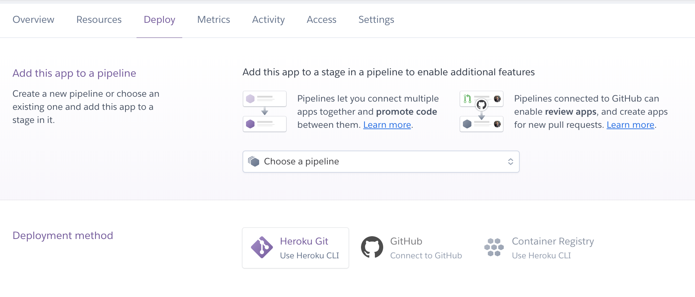

# Steps on Deploying an Angular App to Heroku

## What is Heroku?
Heroku is a platform as a service (PaaS) that enables developers to deploy, manage, and run applications. It uses the source code and dependency file (like package.js for Node.js).

## How do I set up Heroku?
One way to do so is via the Heroku CLI.
` $brew tap heroku/brew && brew install heroku `
` $heroku login ` (create an account first from www.heroku.com)
Run this command from your app’s root directory ` $heroku create ` (the empty Heroku Git repository is automatically set as a remote for your local repository)

## How do I connect my custom domain name (for example from Google Domains) to my Heroku app?
See https://medium.com/@david.gagne/set-up-a-custom-domain-for-your-heroku-application-using-google-domains-guaranteed-a2b2ff934f97
(Note: it may take a day or two for your Google Domains change to be reflected)

## How do I deploy Heroku?
There a couple different ways of deploying Heroku. By logging into heroku.com, clicking on your application, and changing to the deploy tab, different deployment options are presented:


<p align="center"> <i> Figure 1: Deployment options available for a Heroku app </i> </p>
I used the Heroku CLI. 
```
$ heroku login
$ heroku git:clone -a <your-heroku-app-name>
$ cd <your-heroku-app-name>
```

Extra steps for your Angular application include:
1. In package.json, copy ` "@angular/cli”: <your-version-number> `, ` " @angular/compiler-cli": <your-version-number> `, ` "typescript": <your-version-number> ` from devDependencies to Dependencies. 

2. In package.json, add ` "heroku-postbuild": "ng build --prod" ` under scripts

3. In package.json, add 
```
"engines": {
    "node": "<your-version-number>",
    "npm": "<your-version-number>"
  }
```

4. In package.json, add ` "start": "node server.js" `

5. ` npm install enhanced-resolve `

6. ` npm install express path `

7. Copy the following from https://itnext.io/how-to-deploy-angular-application-to-heroku-1d56e09c5147:
```
//Install express server
const express = require('express');
const path = require('path');

const app = express();

// Serve only the static files form the dist directory
app.use(express.static(__dirname + '/dist/<name-of-app>'));

app.get('/*', function(req,res) {
    
res.sendFile(path.join(__dirname+'/dist/<name-of-app>/index.html'));
});

// Start the app by listening on the default Heroku port
app.listen(process.env.PORT || 8080);
```

Then: 
```
$ git add .
$ git commit -m "heroku deployment changes"
$ git push heroku master
```

## What's next?
Following a successful deployment, your app should be built. In the Heroku CLI, you can type ` heroku logs ` and debug from there. Congrats on getting your app up and running!

## Sources
* https://itnext.io/how-to-deploy-angular-application-to-heroku-1d56e09c5147
* www.heroku.com
* https://medium.com/@david.gagne/set-up-a-custom-domain-for-your-heroku-application-using-google-domains-guaranteed-a2b2ff934f97
